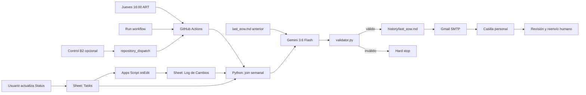

# Amazon EOW Reporter

## Documentación técnica y operativa

**Estado:** Implementado y probado  
**Última actualización:** 2026-08-28  
**Audiencia:** usuarios del tracker, responsables de Analytics y personas que
mantienen la automatización

---

## 1. Qué resuelve

Amazon EOW Reporter transforma los cambios semanales del tracker de WWS y TCP
en un borrador profesional de End of Week.

La persona usuaria sigue trabajando en Google Sheets. La automatización detecta
los cambios de estado, recupera el contexto de cada tarea, redacta un resumen en
inglés con Gemini, controla que el formato sea correcto, guarda una copia en
GitHub y envía el borrador a una casilla personal.

El último paso sigue siendo humano: revisar, editar y reenviar el correo al
equipo interno.

## 2. Experiencia desde el punto de vista del usuario

1. Durante la semana se actualiza la columna `Status` de las tareas.
2. Apps Script registra cada cambio en `Log de Cambios`.
3. El jueves a las 16:00 ART GitHub Actions inicia el proceso automáticamente.
4. Gemini redacta el EOW con los cambios válidos de esa semana.
5. El validador detiene el proceso si el texto no cumple las reglas.
6. El borrador llega a la dirección personal configurada en `EMAIL_TO`.
7. La persona revisa el mensaje, hace los ajustes necesarios y lo reenvía.

También se puede usar **Run workflow** en GitHub Actions para solicitar un
borrador inmediatamente. Ese botón envía un correo real.

## 3. Plataformas y responsabilidades

| Plataforma | Qué ve la persona usuaria | Responsabilidad técnica |
| --- | --- | --- |
| Google Sheets | Tracker de tareas y checkbox opcional | Fuente maestra y registro de cambios |
| Apps Script | Funciona al editar `Status` | Captura timestamp, tarea, estado anterior y nuevo |
| GitHub | Repositorio, historial y botón Run workflow | Aloja código, secretos y reportes |
| GitHub Actions | Run verde o rojo | Ejecuta Python los jueves a las 16:00 ART |
| Gemini API | No requiere interacción directa | Redacta el EOW con datos delimitados |
| Gmail SMTP | Borrador recibido en la casilla personal | Entrega el correo autenticado |
| Revisión humana | Editar y reenviar | Control editorial y decisión final |

## 4. Arquitectura



## 5. Modelo de datos en Google Sheets

### 5.1 `Tasks`

Es la fuente maestra deduplicada. Los encabezados deben coincidir exactamente:

1. `Titulo de Tarea`
2. `Mes`
3. `Fecha`
4. `Propiedad`
5. `Status`
6. `Owner`
7. `Reporter`
8. `LOEE (hs)`
9. `Categoria`
10. `Deadline Estimado`
11. `Link Jira`
12. `Referencias/Links y Comentarios`

Campos que utiliza el reporte:

- `Titulo de Tarea`: clave para unir con el log.
- `Propiedad`: determina WWS, TCP o Both.
- `Categoria`: se usa como workstream.
- `Referencias/Links y Comentarios`: aporta contexto y blockers.

La unión normaliza mayúsculas, minúsculas y espacios. Si existen dos títulos
equivalentes, el proceso se detiene para evitar una asociación incorrecta.

### 5.2 `Log de Cambios`

Apps Script agrega una fila cada vez que cambia `Status`:

1. `Fecha`
2. `Titulo de Tarea`
3. `Status Anterior`
4. `Status Nuevo`

El lector toma la ventana sábado-viernes y conserva el último cambio válido de
cada tarea.

### 5.3 `Control`

`Control!B2` es un disparador opcional para pedir un borrador inmediato mediante
Apps Script. El cron del jueves y el botón manual de GitHub no dependen de B2.
Después de una entrega correcta, Python lo devuelve a `FALSE` si estaba marcado.

## 6. Normalización y selección

### Accounts

| Valor en Sheet | Valor enviado a Gemini |
| --- | --- |
| WWS | WWS |
| TCP | TCP |
| Both, Ambas, Ambos | Both |
| vacío o desconocido | `[CONFIRMAR]` |

### Status

| Valor en Sheet | Estado de salida |
| --- | --- |
| Done | DONE |
| En progreso, In progress | IN PROGRESS |
| Bloqueado, Bloqueada, Blocked, Blocker | BLOCKER |
| Backlog, To do u otro valor | Se ignora |

Si no queda ningún cambio válido, no se llama a Gemini ni se envía un correo
vacío.

## 7. Redacción con Gemini

Modelo: `gemini-3.6-flash`.

El prompt recibe dos contextos delimitados:

- Cambios semanales normalizados.
- `history/last_eow.md` de la ejecución anterior.

Reglas principales:

- Inglés exclusivamente.
- Secciones por workstream.
- Separación WWS / TCP.
- Cada bullet comienza con `[Analytics]`.
- Cada bullet termina con un estado permitido.
- No se permiten em dashes ni en dashes.
- No se inventan datos.
- Toda ambigüedad se marca `[CONFIRMAR]`.
- Los temas de la semana anterior se identifican como carry-forward.
- El reporte termina con `Needs confirmation`.

La llamada se intenta hasta tres veces. Se reintenta tanto ante errores de API
como ante una respuesta que no pasa la validación.

## 8. Validación y hard stops

`validator.py` verifica el contrato antes de cualquier correo:

- Header con fecha `EOW Report - Week Ending YYYY-MM-DD`.
- Al menos un workstream y un bullet.
- Prefijo `[Analytics]`.
- Status final válido.
- Uso exclusivo de guion corto.
- Una única sección `Needs confirmation`.
- Correspondencia de cada `[CONFIRMAR]` con su listado final.

Hard stops:

| Condición | Resultado |
| --- | --- |
| Secret faltante o inválido | Run rojo; no email |
| Header de Sheet modificado | Run rojo; no Gemini |
| Títulos duplicados | Run rojo; no Gemini |
| Sin cambios de Status válidos | Run rojo; no email vacío |
| Gemini falla tres veces | Run rojo; no email |
| Markdown inválido tres veces | Run rojo; no email |
| SMTP falla | Run rojo; reporte no se commitea |
| Reset de B2 falla luego del email | Se registra el error; el email sigue entregado |

## 9. Envío a la casilla personal

Python crea un mensaje MIME de texto plano:

- Subject: `EOW Report - Week Ending YYYY-MM-DD`.
- From: secret `EMAIL_USER`.
- To: secret `EMAIL_TO`.
- Autenticación: App Password almacenada en `EMAIL_PASSWORD`.
- Transporte: `smtp.gmail.com:587` con STARTTLS.

El sistema no envía directamente al equipo. La revisión y el reenvío son un
hard stop humano deliberado.

## 10. Scheduler y ejecuciones manuales

El workflow usa `cron: "0 19 * * 4"`.

GitHub interpreta cron en UTC:

- 19:00 UTC del jueves.
- 16:00 ART del jueves.

Otros triggers:

- `workflow_dispatch`: botón **Run workflow**.
- `repository_dispatch`: llamado opcional desde `Control!B2`.

`concurrency` evita dos ejecuciones simultáneas, pero no impide que una ejecución
manual posterior genere un segundo correo. Run workflow siempre debe tratarse
como un envío real.

## 11. Secretos y permisos

| Secret | Uso |
| --- | --- |
| `GCP_SA_KEY_BASE64` | Service Account para Sheets |
| `SPREADSHEET_ID` | Identificador del tracker |
| `GEMINI_API_KEY` | Gemini API |
| `EMAIL_USER` | Remitente |
| `EMAIL_PASSWORD` | Gmail App Password |
| `EMAIL_TO` | Casilla personal de revisión |

Permisos mínimos:

- Google Sheets API y Google Drive API habilitadas.
- Sheet compartida como Editor con el Service Account.
- GitHub Actions con `contents: write`.
- Gmail con 2-Step Verification y App Password.
- PAT en Apps Script solamente si se habilita el trigger inmediato de B2.

Los valores secretos no aparecen en el código ni en los logs.

## 12. Runbook operativo

### Operación semanal

1. Actualizar `Status` en `Tasks`.
2. Confirmar que `Log de Cambios` recibió la fila.
3. El jueves después de las 16:00 revisar la casilla personal.
4. Revisar los `[CONFIRMAR]`.
5. Editar tono o detalle si hace falta.
6. Reenviar al equipo interno.

### Ejecución inmediata

1. Confirmar que existe al menos un cambio válido de esta semana.
2. En GitHub: Actions > EOW automation > Run workflow.
3. Recordar que el botón envía un correo real.

### Diagnóstico

1. Abrir el run rojo en GitHub Actions.
2. Expandir `Generate and email personal draft`.
3. Leer la última excepción.
4. Corregir la fuente o el permiso; no editar el reporte generado para ocultar
   un problema de datos.

## 13. Evolución del diseño

1. **Idea inicial:** una pestaña semanal nueva y dos fases, generación el jueves
   y envío automático el viernes.
2. **Alineación con la realidad:** se mantuvo el tracker existente y se usó
   `Log de Cambios` como fuente temporal.
3. **Corrección del logger:** Apps Script dejó de depender de una letra fija y
   ahora busca `Status` por nombre.
4. **Protección de datos:** los registros históricos con Both o WWS dentro del
   campo Status se ignoran.
5. **Modelo actualizado:** Gemini 2.0 Flash fue retirado; se migró a Gemini 3.6
   Flash.
6. **Validación real:** se comprobó lectura de B2, generación, archivo histórico
   y manejo de fallos.
7. **Simplificación final:** se eliminó el envío autónomo del viernes. El jueves
   llega un borrador personal y la persona conserva la decisión editorial.

## 14. Limitaciones conocidas

- SMTP no ofrece idempotency key; una interrupción inmediatamente después de
  aceptar el correo podría producir un duplicado al reintentar.
- Cambiar sustancialmente el título rompe el join histórico.
- `Backlog` y `To do` no se consideran avances para el EOW.
- El reporte refleja cambios de Status, no todas las ediciones de comentarios.
- GitHub schedule puede comenzar algunos minutos después de la hora exacta.

---

# Apéndice: código implementado

Los bloques siguientes se generan directamente desde los archivos activos del
repositorio para evitar diferencias entre la documentación y el código.

## Python orchestration: `main.py`

```python
"""Generate and email the weekly EOW draft on Thursday afternoon."""

from __future__ import annotations

import base64
import json
import logging
import os
import smtplib
import sys
import time
from datetime import date, datetime, timedelta, timezone
from email.mime.multipart import MIMEMultipart
from email.mime.text import MIMEText
from pathlib import Path
from typing import Any

import gspread
from google import genai
from google.genai import types
from google.oauth2.service_account import Credentials

from validator import validate_report


LOGGER = logging.getLogger("eow")
ROOT = Path(__file__).resolve().parent
HISTORY_DIR = ROOT / "history"
REPORT_PATH = HISTORY_DIR / "last_eow.md"

CONTROL_TAB = "Control"
CONTROL_CELL = "B2"
TASKS_TAB = "Tasks"
CHANGE_LOG_TAB = "Log de Cambios"
TASKS_HEADERS = (
    "Titulo de Tarea",
    "Mes",
    "Fecha",
    "Propiedad",
    "Status",
    "Owner",
    "Reporter",
    "LOEE (hs)",
    "Categoria",
    "Deadline Estimado",
    "Link Jira",
    "Referencias/Links y Comentarios",
)
CHANGE_LOG_HEADERS = (
    "Fecha",
    "Titulo de Tarea",
    "Status Anterior",
    "Status Nuevo",
)
ACCOUNT_ALIASES = {
    "wws": "WWS",
    "tcp": "TCP",
    "both": "Both",
    "ambas": "Both",
    "ambos": "Both",
}
STATUS_ALIASES = {
    "done": "DONE",
    "en progreso": "IN PROGRESS",
    "in progress": "IN PROGRESS",
    "bloqueado": "BLOCKER",
    "bloqueada": "BLOCKER",
    "blocked": "BLOCKER",
    "blocker": "BLOCKER",
}
GEMINI_MODEL = "gemini-3.6-flash"
GEMINI_ATTEMPTS = 3
GEMINI_RETRY_SECONDS = 5

SHEETS_SCOPES = (
    "https://www.googleapis.com/auth/spreadsheets",
    "https://www.googleapis.com/auth/drive.readonly",
)

SYSTEM_PROMPT = """You are an EOW Report Generator for a Senior Analytics Expert
working as a vendor for two Amazon accounts: WWS (Amazon Sustainability) and
TCP (The Climate Pledge) at Monks agency.

The report is generated and emailed Thursday at 16:00
America/Argentina/Buenos_Aires as a personal draft for manual editing and
forwarding. The supplied week-ending date is the following Friday. Do not
mention this automation, GitHub, checkboxes, prompts, or email delivery in the
report.

Output rules:
1. Write in English only.
2. The first line must be exactly:
   # EOW Report - Week Ending YYYY-MM-DD
3. Group work under meaningful bold workstream headers, for example:
   **Marketing Channel Architecture**
   **Reporting and Other Issues**
   **Platform / Technical**
   **Workflow Optimization**
   Omit a workstream when it has no meaningful logged work.
4. Under a workstream, use the plain account label `WWS:` or `TCP:`. For a
   source row whose Account is `Both`, use `WWS / TCP:`. Keep account-specific
   work separate.
5. Every work bullet must use exactly:
   - [Analytics] description - STATUS -
6. STATUS must be exactly one of:
   DONE
   IN PROGRESS
   BLOCKER
   IN PROGRESS, continues next week
7. Use only short hyphens (-). Never output an en dash or em dash.
8. Preserve tool and dashboard names exactly, including QuickSight, Redshift,
   and GA4.
9. Do not invent facts, dates, owners, metrics, causes, or outcomes. Put the
   exact tag [CONFIRMAR] inline whenever input is ambiguous or incomplete.
   A source value equal to [CONFIRMAR] is explicitly missing and must remain
   visible in the relevant work bullet. For a missing workstream, use the
   header **Unclassified workstream [CONFIRMAR]**. For a missing account,
   include `Account [CONFIRMAR]` in the bullet instead of guessing WWS or TCP.
10. Compare with the prior EOW. An ongoing prior task must be described as
    continuing, not as a fresh item. Use the continuing-next-week status when
    the supplied evidence supports it.
11. Be professional, concise, client-facing, and free of internal jargon.
    Do not include human names unless explicit attribution is required.
12. End with the exact bold header `**Needs confirmation**`.
    If there are no [CONFIRMAR] tags in the workstream body, put exactly `None.`
    below it. Otherwise, repeat every body tag once as numbered lines:
    `1. [CONFIRMAR] concise description`
    These are numbered lines, not hyphen bullets.
13. Output markdown only, with no code fence and no commentary.
"""


def required_env(name: str) -> str:
    value = os.getenv(name, "").strip()
    if not value:
        raise RuntimeError(f"Missing required environment variable: {name}")
    return value


def parse_service_account() -> dict[str, Any]:
    encoded = required_env("GCP_SA_KEY_BASE64")
    try:
        padded = encoded + ("=" * (-len(encoded) % 4))
        decoded = base64.b64decode(padded).decode("utf-8")
        info = json.loads(decoded)
    except (ValueError, UnicodeDecodeError, json.JSONDecodeError) as exc:
        raise RuntimeError("GCP_SA_KEY_BASE64 is not valid base64 JSON.") from exc

    required_fields = {"client_email", "private_key", "token_uri"}
    missing = required_fields.difference(info)
    if missing:
        raise RuntimeError(
            "Service-account JSON is missing: " + ", ".join(sorted(missing))
        )
    return info


def sheets_client() -> gspread.Client:
    credentials = Credentials.from_service_account_info(
        parse_service_account(), scopes=SHEETS_SCOPES
    )
    return gspread.authorize(credentials)


def spreadsheet() -> gspread.Spreadsheet:
    return sheets_client().open_by_key(required_env("SPREADSHEET_ID"))


def checkbox_is_checked(book: gspread.Spreadsheet) -> bool:
    value = book.worksheet(CONTROL_TAB).acell(CONTROL_CELL).value
    return str(value).strip().upper() == "TRUE"


def week_ending_for(day: date | None = None) -> date:
    current = day or datetime.now(timezone.utc).date()
    return current + timedelta(days=(4 - current.weekday()) % 7)


def parse_sheet_date(value: Any) -> date:
    text = str(value).strip()
    formats = (
        "%Y-%m-%d",
        "%m/%d/%Y %H:%M:%S",
        "%d/%m/%Y %H:%M:%S",
        "%m/%d/%Y",
        "%d/%m/%Y",
        "%m/%d/%y",
        "%d/%m/%y",
        "%Y-%m-%dT%H:%M:%S",
    )
    for fmt in formats:
        try:
            return datetime.strptime(text, fmt).date()
        except ValueError:
            continue
    try:
        return datetime.fromisoformat(text.replace("Z", "+00:00")).date()
    except ValueError as exc:
        raise ValueError(f"Unsupported sheet date: {text!r}") from exc


def normalized_key(value: Any) -> str:
    return " ".join(str(value).split()).casefold()


def require_headers(
    tab_name: str, actual: list[str], expected: tuple[str, ...]
) -> None:
    if tuple(actual) != expected:
        raise RuntimeError(
            f"{tab_name} header row must exactly equal: " + " | ".join(expected)
        )


def rows_as_dicts(
    values: list[list[str]], headers: tuple[str, ...]
) -> list[dict[str, str]]:
    rows: list[dict[str, str]] = []
    for raw_row in values[1:]:
        row = list(raw_row[: len(headers)])
        row.extend([""] * (len(headers) - len(row)))
        rows.append(
            dict(zip(headers, (str(value).strip() for value in row)))
        )
    return rows


def weekly_updates(
    book: gspread.Spreadsheet, week_ending: date
) -> list[dict[str, str]]:
    task_values = book.worksheet(TASKS_TAB).get_all_values()
    log_values = book.worksheet(CHANGE_LOG_TAB).get_all_values()
    if not task_values:
        raise RuntimeError(f"Sheet tab {TASKS_TAB!r} is empty.")
    if not log_values:
        raise RuntimeError(f"Sheet tab {CHANGE_LOG_TAB!r} is empty.")
    require_headers(TASKS_TAB, task_values[0], TASKS_HEADERS)
    require_headers(CHANGE_LOG_TAB, log_values[0], CHANGE_LOG_HEADERS)

    tasks_by_title: dict[str, dict[str, str]] = {}
    duplicate_titles: set[str] = set()
    for task in rows_as_dicts(task_values, TASKS_HEADERS):
        key = normalized_key(task["Titulo de Tarea"])
        if not key:
            continue
        if key in tasks_by_title:
            duplicate_titles.add(task["Titulo de Tarea"])
        tasks_by_title[key] = task
    if duplicate_titles:
        raise RuntimeError(
            "Tasks contains duplicate titles: "
            + ", ".join(sorted(duplicate_titles))
        )

    period_start = week_ending - timedelta(days=6)
    latest_events: dict[str, tuple[datetime, dict[str, str]]] = {}
    ignored_invalid_statuses = 0
    for row_number, event in enumerate(
        rows_as_dicts(log_values, CHANGE_LOG_HEADERS), start=2
    ):
        title = event["Titulo de Tarea"]
        if not title:
            continue
        try:
            event_date = parse_sheet_date(event["Fecha"])
        except ValueError as exc:
            raise RuntimeError(
                f"Invalid date on {CHANGE_LOG_TAB}! row {row_number}."
            ) from exc
        if not period_start <= event_date <= week_ending:
            continue

        normalized_status = STATUS_ALIASES.get(
            normalized_key(event["Status Nuevo"])
        )
        if not normalized_status:
            ignored_invalid_statuses += 1
            continue

        key = normalized_key(title)
        timestamp = datetime.combine(event_date, datetime.min.time())
        try:
            timestamp = datetime.strptime(event["Fecha"], "%m/%d/%Y %H:%M:%S")
        except ValueError:
            pass
        previous = latest_events.get(key)
        if previous is None or timestamp >= previous[0]:
            latest_events[key] = (
                timestamp,
                {**event, "status": normalized_status},
            )

    if ignored_invalid_statuses:
        LOGGER.warning(
            "Ignored %s change-log rows whose new value was not a valid status.",
            ignored_invalid_statuses,
        )

    selected: list[dict[str, str]] = []
    for key, (timestamp, event) in sorted(
        latest_events.items(), key=lambda item: item[1][0]
    ):
        task = tasks_by_title.get(key, {})
        account = ACCOUNT_ALIASES.get(
            normalized_key(task.get("Propiedad", "")), "[CONFIRMAR]"
        )
        workstream = task.get("Categoria", "") or "[CONFIRMAR]"
        selected.append(
            {
                "changed_at": timestamp.isoformat(),
                "account": account,
                "workstream": workstream,
                "task_name_description": event["Titulo de Tarea"],
                "status_before": event["Status Anterior"] or "[CONFIRMAR]",
                "status": event["status"],
                "notes_blockers": (
                    task.get("Referencias/Links y Comentarios", "")
                    or "[CONFIRMAR]"
                ),
                "task_matched_in_master": "yes" if task else "no",
            }
        )

    if not selected:
        raise RuntimeError(
            f"No valid status changes found in {CHANGE_LOG_TAB!r} from "
            f"{period_start.isoformat()} through {week_ending.isoformat()}."
        )
    return selected


def read_previous_report() -> str:
    if not REPORT_PATH.exists():
        return "(No prior EOW exists. Treat this as the first run.)"
    content = REPORT_PATH.read_text(encoding="utf-8").strip()
    return content or "(The prior EOW file is empty.)"


def build_user_prompt(
    week_ending: date, updates: list[dict[str, str]], previous: str
) -> str:
    return f"""Create the EOW report for Friday {week_ending.isoformat()}.

WEEKLY SHEET UPDATES (authoritative current-week source):
<weekly_updates>
{json.dumps(updates, ensure_ascii=False, indent=2)}
</weekly_updates>

PREVIOUS EOW (comparison source only):
<previous_eow>
{previous}
</previous_eow>

Use only evidence inside these two delimited inputs. Current-week updates take
precedence for current status. If a required interpretation is unsupported,
use [CONFIRMAR] instead of guessing.
"""


def generate_report(
    week_ending: date, updates: list[dict[str, str]], previous: str
) -> str:
    client = genai.Client(api_key=required_env("GEMINI_API_KEY"))
    prompt = build_user_prompt(week_ending, updates, previous)
    failures: list[str] = []

    for attempt in range(1, GEMINI_ATTEMPTS + 1):
        try:
            response = client.models.generate_content(
                model=GEMINI_MODEL,
                contents=prompt,
                config=types.GenerateContentConfig(
                    system_instruction=SYSTEM_PROMPT,
                    temperature=0.2,
                ),
            )
            report = (response.text or "").strip()
            validation = validate_report(report)
            if validation.is_valid:
                return report + "\n"
            failures.append(f"attempt {attempt}: " + "; ".join(validation.errors))
        except Exception as exc:  # SDK errors vary by transport and version.
            failures.append(f"attempt {attempt}: {type(exc).__name__}: {exc}")

        LOGGER.warning("Gemini attempt %s of %s failed.", attempt, GEMINI_ATTEMPTS)
        if attempt < GEMINI_ATTEMPTS:
            time.sleep(GEMINI_RETRY_SECONDS * attempt)

    raise RuntimeError(
        f"{GEMINI_MODEL} produced no valid report:\n" + "\n".join(failures)
    )


def atomic_write(path: Path, content: str) -> None:
    path.parent.mkdir(parents=True, exist_ok=True)
    temporary = path.with_suffix(path.suffix + ".tmp")
    temporary.write_text(content, encoding="utf-8")
    temporary.replace(path)


def generate_and_email() -> None:
    book = spreadsheet()
    week_ending = week_ending_for()
    updates = weekly_updates(book, week_ending)
    report = generate_report(week_ending, updates, read_previous_report())
    atomic_write(REPORT_PATH, report)
    send_email(report, week_ending.isoformat())

    if checkbox_is_checked(book):
        try:
            book.worksheet(CONTROL_TAB).update_acell(CONTROL_CELL, False)
        except Exception:
            LOGGER.exception(
                "Draft was emailed, but Control!B2 could not be reset."
            )
    LOGGER.info(
        "Validated EOW generated and emailed for %s.",
        week_ending.isoformat(),
    )

def send_email(report: str, week_ending: str) -> None:
    sender = required_env("EMAIL_USER")
    password = required_env("EMAIL_PASSWORD")
    recipients = [
        item.strip() for item in required_env("EMAIL_TO").split(",") if item.strip()
    ]
    if not recipients:
        raise RuntimeError("EMAIL_TO contains no recipients.")

    message = MIMEMultipart("alternative")
    message["Subject"] = f"EOW Report - Week Ending {week_ending}"
    message["From"] = sender
    message["To"] = ", ".join(recipients)
    message.attach(MIMEText(report, "plain", "utf-8"))

    with smtplib.SMTP("smtp.gmail.com", 587, timeout=30) as server:
        server.ehlo()
        server.starttls()
        server.ehlo()
        server.login(sender, password)
        server.sendmail(sender, recipients, message.as_string())


def main() -> int:
    logging.basicConfig(
        level=os.getenv("LOG_LEVEL", "INFO"),
        format="%(asctime)s %(levelname)s %(message)s",
    )
    try:
        generate_and_email()
        return 0
    except Exception:
        LOGGER.exception("EOW pipeline failed.")
        return 1


if __name__ == "__main__":
    sys.exit(main())
```

## Output validator: `validator.py`

```python
"""Validation rules for generated EOW markdown reports."""

from __future__ import annotations

import re
from dataclasses import dataclass


HEADER_RE = re.compile(
    r"^# EOW Report - Week Ending \d{4}-\d{2}-\d{2}$", re.MULTILINE
)
WORKSTREAM_HEADER_RE = re.compile(r"^\*\*(?!Needs confirmation\*\*$).+\*\*$")
ACCOUNT_HEADER_RE = re.compile(r"^(WWS|TCP|WWS / TCP):$")
STATUS_RE = (
    r"(?:DONE|IN PROGRESS|BLOCKER|IN PROGRESS, continues next week)"
)
BULLET_RE = re.compile(rf"^- \[Analytics\] .+ - {STATUS_RE} -$")
CONFIRM_SECTION_RE = re.compile(
    r"^\*\*Needs confirmation\*\*[ \t]*$", re.MULTILINE
)


@dataclass(frozen=True)
class ValidationResult:
    """Structured validator result."""

    errors: tuple[str, ...]

    @property
    def is_valid(self) -> bool:
        return not self.errors

    def raise_for_errors(self) -> None:
        if self.errors:
            raise ValueError("Invalid EOW report:\n- " + "\n- ".join(self.errors))


def validate_report(report: str) -> ValidationResult:
    """Validate the complete output contract without modifying model text."""
    errors: list[str] = []
    normalized = report.strip()

    if not normalized:
        return ValidationResult(("Report is empty.",))

    if "—" in normalized or "–" in normalized:
        errors.append("Only short hyphens are allowed; en/em dashes were found.")

    if not HEADER_RE.search(normalized):
        errors.append(
            "Missing exact '# EOW Report - Week Ending YYYY-MM-DD' header."
        )

    confirmation_headers = list(CONFIRM_SECTION_RE.finditer(normalized))
    if len(confirmation_headers) != 1:
        errors.append("Exactly one '**Needs confirmation**' section is required.")
        body = normalized
        confirmation_text = ""
    else:
        split_at = confirmation_headers[0].start()
        body = normalized[:split_at].rstrip()
        confirmation_text = normalized[confirmation_headers[0].end() :].strip()

        if not confirmation_text:
            errors.append("The Needs confirmation section cannot be empty.")

    workstream_count = 0
    bullet_count = 0
    workstream_has_bullet = False
    seen_workstream = False

    for line_number, raw_line in enumerate(body.splitlines(), start=1):
        line = raw_line.strip()
        if not line or HEADER_RE.fullmatch(line):
            continue

        if WORKSTREAM_HEADER_RE.fullmatch(line):
            if seen_workstream and not workstream_has_bullet:
                errors.append("A workstream section has no valid work bullets.")
            workstream_count += 1
            seen_workstream = True
            workstream_has_bullet = False
            continue

        if ACCOUNT_HEADER_RE.fullmatch(line):
            if not seen_workstream:
                errors.append(
                    f"Account label before a workstream on line {line_number}."
                )
            continue

        if line.startswith("-"):
            bullet_count += 1
            if not BULLET_RE.fullmatch(line):
                errors.append(
                    f"Invalid bullet syntax or status on line {line_number}: {line}"
                )
            elif not seen_workstream:
                errors.append(
                    f"Work bullet before a workstream on line {line_number}."
                )
            else:
                workstream_has_bullet = True
            continue

        errors.append(f"Unexpected body line {line_number}: {line}")

    if seen_workstream and not workstream_has_bullet:
        errors.append("The final workstream section has no valid work bullets.")
    if workstream_count == 0:
        errors.append("At least one bold workstream section is required.")
    if bullet_count == 0:
        errors.append("At least one [Analytics] work bullet is required.")

    body_confirmations = body.count("[CONFIRMAR]")
    confirmation_confirmations = confirmation_text.count("[CONFIRMAR]")
    if body_confirmations != confirmation_confirmations:
        errors.append(
            "Needs confirmation must repeat each body [CONFIRMAR] tag exactly once "
            f"(body={body_confirmations}, section={confirmation_confirmations})."
        )

    if body_confirmations == 0 and confirmation_text != "None.":
        errors.append(
            "Needs confirmation must contain exactly 'None.' when no tags exist."
        )
    if body_confirmations > 0:
        confirmation_lines = [
            line.strip()
            for line in confirmation_text.splitlines()
            if line.strip()
        ]
        if any(not re.fullmatch(r"\d+\. \[CONFIRMAR\] .+", line) for line in confirmation_lines):
            errors.append(
                "Confirmation entries must be numbered as "
                "'1. [CONFIRMAR] description'."
            )

    return ValidationResult(tuple(dict.fromkeys(errors)))


def assert_valid_report(report: str) -> None:
    """Raise ValueError when the report violates any output rule."""
    validate_report(report).raise_for_errors()
```

## Google Sheets event capture: `apps-script/Code.gs`

```javascript
/**
 * Append status changes from Tasks to Log de Cambios.
 *
 * The columns are resolved from row 1, so moving Status or Titulo de Tarea
 * does not silently break the trigger.
 */
function onEdit(e) {
  if (!e || !e.range) return;

  const sheet = e.range.getSheet();
  if (sheet.getName() !== "Tasks") return;
  if (
    e.range.getRow() <= 1 ||
    e.range.getNumRows() !== 1 ||
    e.range.getNumColumns() !== 1
  ) {
    return;
  }

  const headers = sheet
    .getRange(1, 1, 1, sheet.getLastColumn())
    .getDisplayValues()[0];
  const taskColumn = headers.indexOf("Titulo de Tarea") + 1;
  const statusColumn = headers.indexOf("Status") + 1;
  if (!taskColumn || !statusColumn) {
    throw new Error(
      "Tasks must contain Titulo de Tarea and Status headers."
    );
  }
  if (e.range.getColumn() !== statusColumn) return;

  const taskTitle = sheet.getRange(e.range.getRow(), taskColumn).getValue();
  const oldStatus = e.oldValue === undefined ? "" : e.oldValue;
  const newStatus =
    e.value === undefined ? e.range.getDisplayValue() : e.value;
  if (!taskTitle || String(oldStatus) === String(newStatus)) return;

  const logSheet = e.source.getSheetByName("Log de Cambios");
  if (!logSheet) {
    throw new Error('Missing required tab "Log de Cambios".');
  }

  logSheet.appendRow([new Date(), taskTitle, oldStatus, newStatus]);
}

/**
 * Install this function as an "On edit" trigger. It dispatches generation
 * only when Control!B2 changes to TRUE.
 */
function dispatchEowOnEdit(e) {
  if (!e || !e.range) return;
  if (
    e.range.getSheet().getName() !== "Control" ||
    e.range.getA1Notation() !== "B2" ||
    String(e.value).toUpperCase() !== "TRUE"
  ) {
    return;
  }

  const props = PropertiesService.getScriptProperties();
  const owner = props.getProperty("GH_OWNER");
  const repo = props.getProperty("GH_REPO");
  const token = props.getProperty("GH_TOKEN");
  if (!owner || !repo || !token) {
    throw new Error("Missing GH_OWNER, GH_REPO, or GH_TOKEN script property.");
  }

  const response = UrlFetchApp.fetch(
    `https://api.github.com/repos/${owner}/${repo}/dispatches`,
    {
      method: "post",
      contentType: "application/json",
      headers: {
        Authorization: `Bearer ${token}`,
        Accept: "application/vnd.github+json",
        "X-GitHub-Api-Version": "2022-11-28",
      },
      payload: JSON.stringify({
        event_type: "trigger_eow_generation",
      }),
      muteHttpExceptions: true,
    }
  );

  if (response.getResponseCode() !== 204) {
    throw new Error(
      `GitHub dispatch failed: ${response.getResponseCode()} ` +
        response.getContentText()
    );
  }
}
```

## GitHub Actions workflow: `.github/workflows/eow_automation.yml`

```yaml
name: EOW automation

on:
  schedule:
    # GitHub cron is UTC: Thursday 16:00 America/Argentina/Buenos_Aires.
    - cron: "0 19 * * 4"
  repository_dispatch:
    types: [trigger_eow_generation]
  workflow_dispatch: {}

permissions:
  contents: write

concurrency:
  group: eow-automation
  cancel-in-progress: false

jobs:
  run:
    runs-on: ubuntu-latest
    timeout-minutes: 15
    env:
      GCP_SA_KEY_BASE64: ${{ secrets.GCP_SA_KEY_BASE64 }}
      GEMINI_API_KEY: ${{ secrets.GEMINI_API_KEY }}
      EMAIL_USER: ${{ secrets.EMAIL_USER }}
      EMAIL_PASSWORD: ${{ secrets.EMAIL_PASSWORD }}
      SPREADSHEET_ID: ${{ secrets.SPREADSHEET_ID }}
      EMAIL_TO: ${{ secrets.EMAIL_TO }}

    steps:
      - name: Check out repository
        uses: actions/checkout@v4
        with:
          fetch-depth: 0

      - name: Set up Python
        uses: actions/setup-python@v5
        with:
          python-version: "3.11"
          cache: pip

      - name: Install dependencies
        run: pip install -r requirements.txt

      - name: Generate and email personal draft
        id: eow
        run: python main.py

      - name: Commit generated report
        shell: bash
        run: |
          if git diff --quiet -- history; then
            echo "No history state changed."
            exit 0
          fi
          git config user.name "github-actions[bot]"
          git config user.email "41898282+github-actions[bot]@users.noreply.github.com"
          git add history/
          git commit -m "Update EOW automation state"
          git push
```

## Python dependencies: `requirements.txt`

```text
google-auth
google-genai
gspread
```
