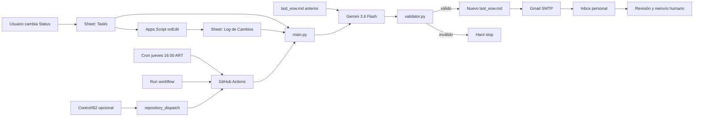

# Amazon EOW Reporter - memoria del proyecto

**Corte de información:** 2026-08-28  
**Estado:** implementación funcional; cambios finales abiertos en PR  
**Propósito de este documento:** permitir que otra persona entienda por qué el
sistema existe, cómo evolucionó, qué está vigente y cómo continuarlo sin
reconstruir las conversaciones originales.

> Esta es una síntesis de decisiones y evidencia, no una transcripción del chat.
> Los valores de credenciales, identificadores privados y datos del tracker se
> omiten deliberadamente.

## 1. Resumen ejecutivo

Amazon EOW Reporter convierte cambios semanales de tareas de Analytics para las
cuentas WWS y TCP en un borrador de End of Week en inglés.

La fuente de verdad sigue siendo el Google Sheet existente. Apps Script registra
los cambios de `Status`; GitHub Actions ejecuta Python los jueves a las 16:00
ART; Gemini redacta; un validador aplica un contrato estricto; Gmail entrega el
borrador a una casilla personal. La automatización termina allí. La persona
revisa, edita y reenvía el mensaje al equipo.

La decisión central del producto es conservar un control humano antes de la
comunicación interna. No existe envío automático final al equipo.

## 2. Alcance vigente

### Incluido

- Captura de cambios de estado desde `Tasks`.
- Registro append-only en `Log de Cambios`.
- Selección de la ventana semanal sábado-viernes.
- Enriquecimiento de cada evento con datos de la tarea maestra.
- Normalización de cuenta y estado.
- Generación en inglés mediante `gemini-3.6-flash`.
- Hasta tres intentos ante error de API o salida inválida.
- Validación determinista del Markdown.
- Escritura de `history/last_eow.md`.
- Envío de un draft personal por Gmail SMTP.
- Ejecución programada, manual y opcional desde `Control!B2`.

### Fuera de alcance por decisión

- Enviar automáticamente al equipo interno.
- Mantener una pestaña semanal adicional.
- Adivinar datos ausentes.
- Considerar `Backlog` o `To do` como avances del EOW.
- Crear o editar Google Docs/Slides como parte del pipeline.
- Reemplazar la revisión editorial humana.

## 3. Resultado que se buscó

El problema original era el trabajo manual de recordar lo sucedido, buscar
tareas y comentarios, traducir el tracker al formato del EOW, separar WWS/TCP y
controlar tono y estados.

El resultado esperado se simplificó a esta experiencia:

1. Durante la semana se cambia `Status` en `Tasks`.
2. El jueves a las 16:00 ART llega un draft a la casilla personal.
3. La persona resuelve `[CONFIRMAR]`, edita y reenvía.

No se requiere una aplicación nueva ni una operación semanal dentro de Cursor.

## 4. Arquitectura vigente



### Responsabilidades

| Componente | Responsabilidad |
| --- | --- |
| Google Sheets | Fuente maestra y registro temporal |
| Apps Script | Capturar cambios y, opcionalmente, disparar una ejecución |
| GitHub Actions | Agenda, entorno, secretos y ejecución |
| `main.py` | Lectura, selección, prompt, generación, persistencia y email |
| `validator.py` | Contrato determinista de salida |
| Gemini | Redacción, no validación ni acceso al Sheet |
| Gmail SMTP | Entrega a la casilla personal |
| Persona revisora | Decisión editorial y distribución final |

## 5. Contrato exacto del Google Sheet

Los nombres se comparan de forma exacta y en este orden. Cambiar un header
provoca un hard stop antes de llamar a Gemini.

### Pestaña `Tasks`

1. `Titulo de Tarea`
2. `Mes`
3. `Fecha`
4. `Propiedad`
5. `Status`
6. `Owner`
7. `Reporter`
8. `LOEE (hs)`
9. `Categoria`
10. `Deadline Estimado`
11. `Link Jira`
12. `Referencias/Links y Comentarios`

`Mes` es, por lo tanto, el segundo header y coincide con el código vigente.

### Pestaña `Log de Cambios`

1. `Fecha`
2. `Titulo de Tarea`
3. `Status Anterior`
4. `Status Nuevo`

### Pestaña `Control`

- `B2`: checkbox opcional.
- El cron y **Run workflow** no dependen de este checkbox.
- Si estaba en `TRUE`, se intenta resetear después de un email exitoso.

## 6. Reglas de selección y normalización

La fecha de reporte es el viernes de la semana corriente. La ventana de eventos
comprende ese viernes y los seis días anteriores.

Por cada título se conserva el último cambio válido dentro de la ventana. Luego
se une con `Tasks` usando el título con espacios normalizados y comparación
case-insensitive.

### Estados aceptados

| Entrada | Salida |
| --- | --- |
| `Done` | `DONE` |
| `En progreso`, `In progress` | `IN PROGRESS` |
| `Bloqueado`, `Bloqueada`, `Blocked`, `Blocker` | `BLOCKER` |
| cualquier otro valor | fila ignorada con warning |

### Cuentas aceptadas

| Entrada | Salida |
| --- | --- |
| `WWS` | `WWS` |
| `TCP` | `TCP` |
| `Both`, `Ambas`, `Ambos` | `Both` |
| vacío o desconocido | `[CONFIRMAR]` |

`Categoria` o comentarios ausentes también se convierten en `[CONFIRMAR]`.
Los títulos duplicados en `Tasks` detienen la ejecución porque volverían
ambigua la unión.

## 7. Contrato del EOW

Gemini recibe únicamente los eventos semanales normalizados y el EOW anterior.
Las instrucciones principales son:

- inglés únicamente;
- header `# EOW Report - Week Ending YYYY-MM-DD`;
- secciones de workstream en negrita;
- separación `WWS:`, `TCP:` o `WWS / TCP:`;
- bullets con forma `- [Analytics] descripción - STATUS -`;
- sólo estados permitidos;
- sólo guion corto;
- nombres de herramientas preservados;
- no inventar información;
- usar `[CONFIRMAR]` ante toda ambigüedad;
- distinguir carry-forward usando el reporte anterior;
- terminar con una única sección `**Needs confirmation**`.

`validator.py` vuelve estas reglas comprobables. Si ninguna de las tres
respuestas cumple, no se envía correo.

## 8. Schedule y formas de ejecución

### Programada

```yaml
cron: "0 19 * * 4"
```

GitHub cron opera en UTC: 19:00 UTC equivale a 16:00 ART el jueves.

### Manual

**Actions > EOW automation > Run workflow** ejecuta el flujo completo y envía
un email real. No es un dry run.

### Checkbox opcional

Un trigger instalable de Apps Script puede observar `Control!B2` y llamar a
`repository_dispatch` con el evento `trigger_eow_generation`.

## 9. Evolución y decisiones

### Etapa 1 - blueprint inicial

La primera propuesta asumía una pestaña `Weekly Updates` y dos etapas:
generación el jueves y envío automático el viernes. Esta solución no coincidía
con la estructura real del tracker y agregaba operación innecesaria.

### Etapa 2 - adaptación al tracker existente

Al revisar el Sheet real se identificaron `Tasks`, `Log de Cambios` y `Control`.
Se reemplazó la tabla semanal imaginada por una unión entre eventos y maestro.
El tiempo vive en el log; el contexto vive en `Tasks`.

### Etapa 3 - corrección de Apps Script

El logger original asumía una letra fija para `Status`. En la tabla real,
`Status` no estaba en esa posición. Se cambió el script para resolver
`Titulo de Tarea` y `Status` por nombre de header, evitando fallos silenciosos
cuando se mueven columnas.

### Etapa 4 - tolerancia al historial defectuoso

Había filas antiguas donde valores de cuenta, como `WWS` o `Both`, habían
quedado en el campo de estado. En vez de convertir datos dudosos, el lector
acepta sólo estados conocidos e ignora el resto con un warning.

### Etapa 5 - cambio de modelo

`gemini-2.0-flash` devolvió 404 por retiro del modelo. Se migró a
`gemini-3.6-flash`, manteniendo retries y validación. No hay fallback implícito
a otro modelo.

### Etapa 6 - simplificación del lifecycle

Se eliminó `history/pending_email.txt`, el modo `send-email` y el envío del
viernes. Generar y entregar el draft personal ahora forman una única ejecución
del jueves. Esto evita estado intermedio y conserva la revisión humana.

### Etapa 7 - documentación

Se creó documentación técnica con apéndices generados desde el código y una
presentación de trece slides. La slide del modelo de datos originalmente
resumía sólo cinco campos de `Tasks`; se actualizó para mostrar los doce
headers exactos, incluido `Mes`.

## 10. Hitos verificables en Git

| Commit | Hito |
| --- | --- |
| `3997107` | Pipeline inicial |
| `b7f4027` | Adaptación al tracker real y Apps Script |
| `6ef85d8` | Migración a Gemini 3.6 Flash |
| `78f465a` | Draft personal unificado los jueves |
| `7c3eaca` | Trigger manual declarado explícitamente |
| `02dc474` | Documentación técnica y presentación |

El trabajo final está reunido en la
[PR #1](https://github.com/franciscoregoli-monks/EOW-writer/pull/1).

## 11. Evidencia de ejecuciones

Las pruebas históricas útiles para diagnóstico son:

| Fecha UTC | Commit | Resultado | Evidencia |
| --- | --- | --- | --- |
| 2026-08-27 21:40 | `3997107` | failure | [run](https://github.com/franciscoregoli-monks/EOW-writer/actions/runs/33119198281) |
| 2026-08-27 21:49 | `3997107` | success | [run](https://github.com/franciscoregoli-monks/EOW-writer/actions/runs/33119866161) |
| 2026-08-27 21:49 | `3997107` | success | [run](https://github.com/franciscoregoli-monks/EOW-writer/actions/runs/33119874223) |
| 2026-08-28 18:54 | `b7f4027` | failure | [run](https://github.com/franciscoregoli-monks/EOW-writer/actions/runs/33201445082) |
| 2026-08-28 18:56 | `b7f4027` | failure | [run](https://github.com/franciscoregoli-monks/EOW-writer/actions/runs/33201595283) |
| 2026-08-28 19:29 | `6ef85d8` | success | [run](https://github.com/franciscoregoli-monks/EOW-writer/actions/runs/33204067849) |

Los fallos de `b7f4027` llevaron al diagnóstico del retiro de Gemini 2.0; el
éxito de `6ef85d8` confirmó el cambio de modelo. Los commits posteriores
modificaron el lifecycle de entrega y deben probarse mediante **Run workflow**
después de estar disponibles en la rama desde la que se ejecute.

## 12. Secretos y permisos

GitHub Actions requiere estos nombres exactos:

- `GCP_SA_KEY_BASE64`
- `SPREADSHEET_ID`
- `GEMINI_API_KEY`
- `EMAIL_USER`
- `EMAIL_PASSWORD`
- `EMAIL_TO`

No copiar sus valores a issues, documentación, logs o commits.

### Google

- El Service Account necesita acceso de Editor al Sheet.
- Se habilitan Google Sheets API y Google Drive API.
- No requiere rol de administrador ni domain-wide delegation.
- El scope de Drive del código es read-only; el scope de Sheets permite leer y
  resetear `Control!B2`.

### Gmail

- Se usa App Password con 2-Step Verification.
- No se usa la contraseña normal de la cuenta.
- No se usa Gmail API.

### GitHub

- El workflow solicita `contents: write` para commitear `history/`.
- El trigger B2, si se usa, guarda un token fine-grained en Script Properties,
  nunca en una celda ni en el código.

### Cursor Cloud

Las credenciales de GitHub Actions no aparecen automáticamente dentro de una VM
de Cursor. Para ejecutar integraciones reales desde un agente deben configurarse
como secretos del entorno de Cloud Agents y abrir una sesión nueva. El
consentimiento OAuth personal de Google no puede ser auto-otorgado por el
agente. Como el repositorio era público al documentar este punto, la inyección
de secretos en agentes públicos debe evaluarse con especial cuidado; hacer el
repositorio privado es la opción más segura.

## 13. Comportamiento ante fallos

| Fallo | Comportamiento |
| --- | --- |
| Secret faltante o JSON inválido | run rojo; sin email |
| Pestaña vacía o headers diferentes | run rojo antes de Gemini |
| Títulos duplicados | run rojo antes de Gemini |
| Fecha del log ilegible | run rojo con número de fila |
| Sin estados válidos en la semana | run rojo; sin email vacío |
| Gemini/API o formato inválido | hasta tres intentos; luego run rojo |
| SMTP falla | run rojo; el reporte no llega a commitearse |
| Reset B2 falla después del SMTP | se registra; el email sigue siendo exitoso |

## 14. Riesgos y limitaciones conocidas

1. SMTP no ofrece idempotency key. Una interrupción después de aceptar el
   mensaje y antes de completar el job puede duplicar un email al reintentar.
2. El título es la clave de unión. Renombrarlo puede separar un evento de su
   contexto maestro.
3. Sólo los cambios de `Status` generan eventos; editar comentarios no hace que
   una tarea entre por sí sola al EOW.
4. El cron de GitHub puede comenzar algunos minutos tarde.
5. `concurrency` evita simultaneidad, no un segundo envío manual posterior.
6. `history/last_eow.md` es estado mutable, no un archivo histórico por semana.
7. No hay suite automatizada de tests versionada; gran parte de la validación
   realizada hasta ahora fue de integración y assertions ad hoc.

## 15. Runbook de mantenimiento

### Operación semanal

1. Confirmar que los cambios de `Status` aparecen en `Log de Cambios`.
2. Después de las 16:00 ART del jueves, revisar Actions y la casilla personal.
3. Resolver cada `[CONFIRMAR]`.
4. Editar y reenviar manualmente.

### Diagnóstico de un run rojo

1. Abrir el run y el paso `Generate and email personal draft`.
2. Identificar si el fallo ocurrió en datos, Gemini, validación o SMTP.
3. Corregir la fuente o permiso; no maquillar manualmente el archivo generado.
4. Recordar que reejecutar puede enviar un email real.

### Cambio de columnas

1. Modificar `TASKS_HEADERS` o `CHANGE_LOG_HEADERS` en `main.py`.
2. Ajustar Apps Script si cambia `Titulo de Tarea` o `Status`.
3. Actualizar este documento, la documentación técnica y la presentación.
4. Probar con datos representativos antes de la próxima ejecución programada.

### Cambio de modelo

1. Verificar que el modelo esté disponible en la API usada por `google-genai`.
2. Cambiar `GEMINI_MODEL`.
3. Validar varias salidas contra `validator.py`.
4. Mantener el modelo explícito; no introducir fallback silencioso.

## 16. Handoff para una nueva persona

Orden de lectura recomendado:

1. Este documento para contexto y decisiones.
2. [`README.md`](../README.md) para setup y primera ejecución.
3. [`amazon-eow-reporter-technical.md`](amazon-eow-reporter-technical.md) para
   detalle técnico y snapshots del código.
4. [`main.py`](../main.py) y [`validator.py`](../validator.py) como fuente de
   verdad ejecutable.
5. [`apps-script/Code.gs`](../apps-script/Code.gs) para captura y trigger.
6. [Workflow](../.github/workflows/eow_automation.yml) para lifecycle.
7. Historial de la [PR #1](https://github.com/franciscoregoli-monks/EOW-writer/pull/1)
   y runs enlazados arriba para contexto de pruebas.

Preguntas que una persona nueva debería poder responder después de leer:

- ¿Qué evento hace entrar una tarea al EOW?
- ¿Por qué `Tasks` y `Log de Cambios` se necesitan mutuamente?
- ¿Qué puede enviar un email real?
- ¿Dónde termina la automatización y empieza la responsabilidad humana?
- ¿Qué se detiene antes de Gemini y qué se detiene antes de SMTP?
- ¿Qué credencial corresponde a cada plataforma?

## 17. Próximos pasos recomendados

1. Integrar la PR cuando la revisión humana esté completa.
2. Ejecutar manualmente el workflow final y confirmar recepción del draft.
3. Verificar que el Apps Script vigente esté instalado en el Sheet real.
4. Decidir si `Control!B2` se habilita; es opcional.
5. Agregar tests unitarios para fechas, headers, normalización, duplicados y
   validación.
6. Considerar historial por fecha en vez de sobrescribir un único archivo.
7. Revisar periódicamente disponibilidad del modelo y expiración de tokens/App
   Passwords.

## 18. Criterio para mantener esta memoria

Actualizar este archivo cuando cambie cualquiera de estos elementos:

- objetivo o destinatario del email;
- horario o zona horaria;
- tabs, headers o reglas de selección;
- modelo de Gemini o contrato del prompt;
- credenciales y límites de permisos;
- frontera entre automatización y revisión humana;
- riesgos, incidentes o decisiones descartadas.

Registrar el porqué del cambio, no sólo el resultado. El código explica cómo
funciona el sistema; esta memoria debe explicar por qué funciona de esa manera.
