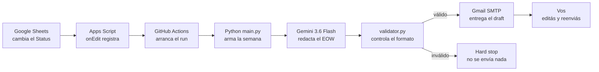

# Pipeline para copiar y pegar

Tres formatos del mismo recorrido, para llevarlo a cualquier slide.

El archivo `amazon-eow-reporter-pipeline.pptx` contiene el mismo diagrama en
formas nativas: se puede abrir, seleccionar todo y pegar dentro de otro deck
conservando texto y colores editables.

## 1. Cadena corta

Sheets → Apps Script → GitHub Actions → Python → Gemini → Validador → Gmail → Vos

## 2. Recorrido con la data de cada paso

```text
1. Google Sheets      Cambia el Status            -> fila editada en Tasks
2. Apps Script        onEdit registra el evento   -> fila en Log de Cambios
3. GitHub Actions     Arranca el run              -> runner con los secrets
4. Python main.py     Arma la semana              -> cambios normalizados
5. Gemini 3.6 Flash   Redacta el EOW              -> markdown en inglés
6. validator.py       Controla el formato         -> aprobado o hard stop
7. Gmail SMTP         Entrega el draft            -> mail a tu casilla
8. Vos                Editás y reenviás           -> EOW enviado al equipo
```

Disparadores: cron del jueves 16:00 ART, Run workflow manual, checkbox
`Control!B2` opcional.

Hard stops: sin cambios válidos, headers distintos, Gemini sin salida válida,
validador rechazando el texto, o SMTP fallando. Títulos repetidos en `Tasks` no
detienen el run.

## 3. Diagrama Mermaid


